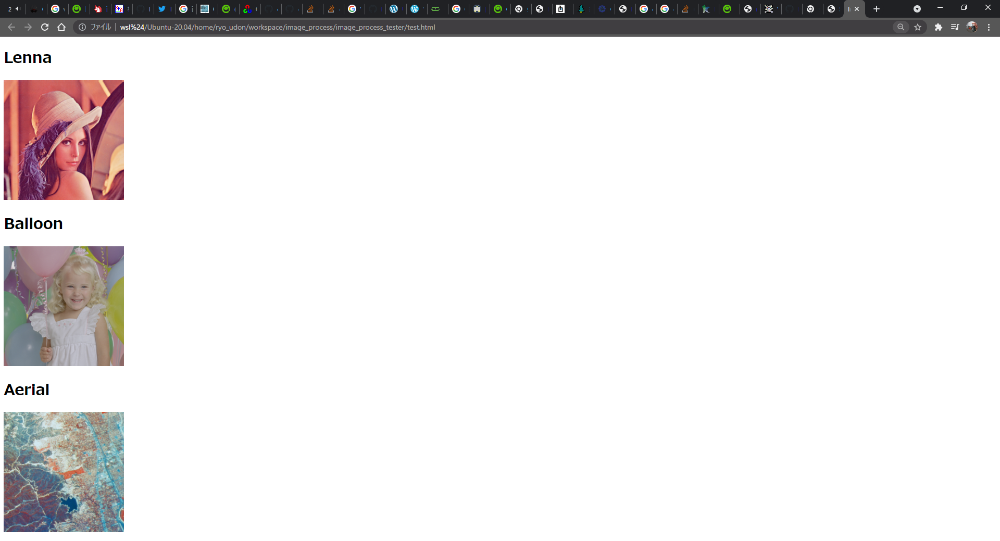
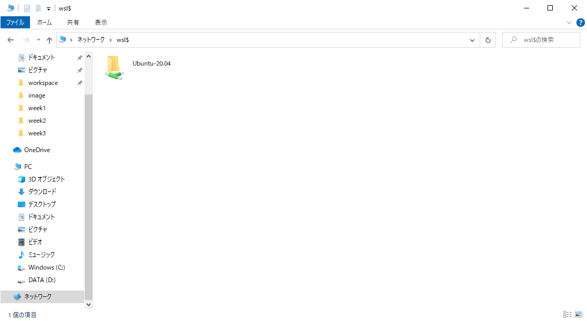

# html_imshow_for_wsl



## What is html_imshow

This is a html file creator with C++.

While you are working image processing in WSL (Windows Subsystem for Linux), you may face a big problem.

Yes, **you cannot use imshow with WSL**.

This is really bothering.

So I made a simple library which is called html_imshow.

This is really simple. Just create html file with the image you want see.


## Requirements

* CMake

## How to use it?

### Install

First, clone this repo to your workspace.

    git clone https://github.com/RYO0115/html_imshow_for_wsl.git


move to html_imshow_for_wsl directory and run below commands.

    cd build
    cmake ..
    make
    sudo make install


### Editing CMakeLists in your project

After make install, you are ready for using this.

Go to your project that you want to have a look with this library, and open CMakeLists.txt with your editor.

What you need to do is just add find_package() method and add this library to your application.

Your new CMakeLists.txt will be look like this

```cmake
# Cmake version
cmake_minimum_required(VERSION 3.0)

# Project Name and Language
project(image_process_sample CXX)

set(CMAKE_CXX_FLAGS "-O2 -Wall -pthread")

find_package(OpenCV REQUIRED)
find_package(html_imshow REQUIRED)

include_directories(
	${PROJECT_SOURCE_DIR}/include
    ${OpenCV_INCLUDE_DIRS}
)

link_directories(
	${PROJECT_SOURCE_DIR}
)


add_executable(opencv_tester
    src/opencv_tester.cpp
)

target_link_libraries(
    opencv_tester
    ${OpenCV_LIBRARIES}
    html_imshow
)

```

What you need in here is 

    find_package(html_inshow REQUIRED)

and adding **html_imshow** to your target_link_libraries.

    target_link_libraries(
        opencv_tester
        ${OpenCV_LIBRARIES}
        html_imshow
    )


### Editing your .cpp code

I have also added some sample in /test direcotry in this repo.

```cpp

#include <html_imshow.hpp>

int main(void)
{

    HtmlImshow hi("test.html");
    hi.CreateHeader("Image View Test", "jp");
    hi.CreateFooter();

    HtmlImshow::ImageInfo info;
    info.title = "Lenna";
    info.width = 256;
    info.height = 256;
    hi.AddImageViewSpace("../image/color/Lenna.bmp", info);

    info.title="Balloon";
    hi.AddImageViewSpace("../image/color/Balloon.bmp", info);

    info.title="Aerial";
    hi.AddImageViewSpace("../image/color/Aerial.bmp", info);

    hi.OutputToHtml();

    return(0);
}
```

Let's look with the lines.

```cpp
#include <html_imshow.hpp>
```

This is the only .hpp that you need to include.

```cpp
    HtmlImshow hi("test.html");
```

When you call HtmlImshow class you need to set the path and name of output html file.


```cpp
    hi.CreateHeader("Image View Test", "jp");
    hi.CreateFooter();
```

These two lines are creating header and footer of html file.

If you want to create English pages, please change "jp" to "en".

```cpp
    HtmlImshow::ImageInfo info;
    info.title = "Lenna";
    info.width = 256;
    info.height = 256;
    hi.AddImageViewSpace("../image/color/Lenna.bmp", info);

    info.title="Balloon";
    hi.AddImageViewSpace("../image/color/Balloon.bmp", info);
```

Next is setting of image that you want to show in the html page.

HtmlImshow class has struct type called ImageInfo.

This type has three variables. title of image(std::string), width of image(int), height of image(int).

You need to define this to show image.

And AddImageViewSpace function will set these configuration and image path to output file additionaly.


```cpp
    hi.OutputToHtml();
```

Finally OutputToHtml() function will write all the code that you created in your app to html file which you have selected at the beginning.

### How to open html file?

While you are using WSL, you can open Linux direcotries from exploreers in you Windows.

Open you explorer and enter the path below.

    \\wsl$

Then you can access to your Ubuntu in WSL.



Move to your project directory, and double click html file that you created.

Finally you can see the image below.

